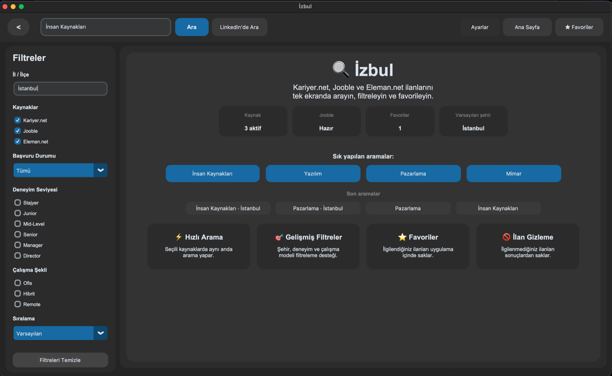
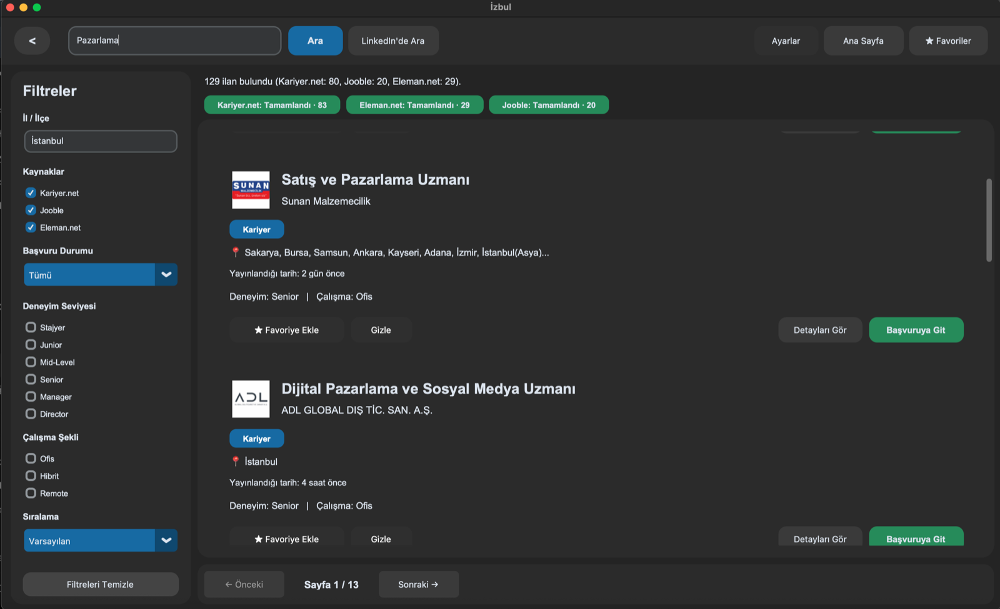
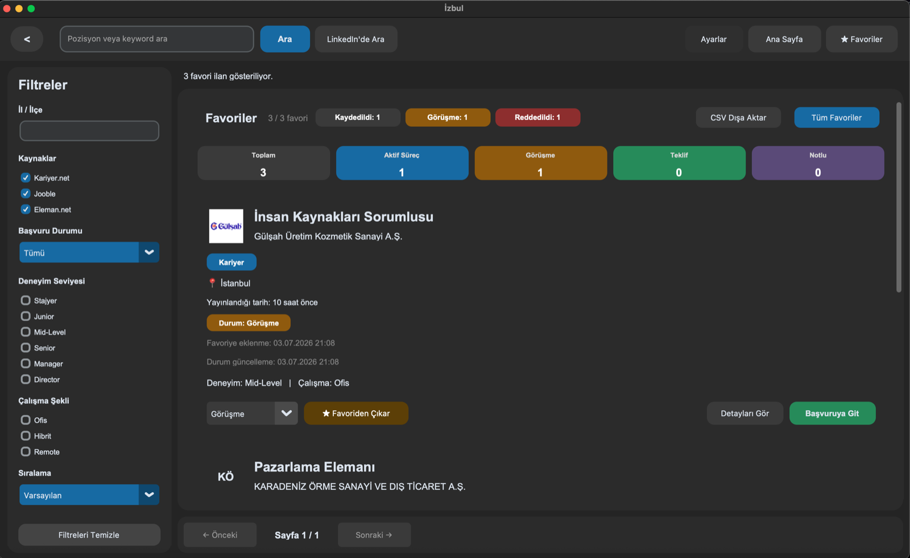

# İzbul

İzbul is a desktop job search app built with Python and CustomTkinter.

The app searches job listings, displays them in a single interface, supports filters, pagination, favorites, and external LinkedIn job search links.

## Screenshots

### Home



### Search Results



### Favorites



## Ownership

İzbul was created by **Ümit Ege Güldez**.

© 2026 Ümit Ege Güldez. Tüm hakları saklıdır.

Bu projenin kaynak kodu, tasarımı, uygulama adı ve dağıtım paketleri Ümit Ege Güldez'e aittir. Yazılı izin olmadan kopyalanamaz, değiştirilemez, yeniden dağıtılamaz, satılamaz veya başka bir kişi/kurum tarafından sahiplenilemez.

Bu reponun public olarak görüntülenebilmesi kaynak kodun, tasarımın, uygulama adının veya dağıtım paketlerinin kullanımına, kopyalanmasına, değiştirilmesine, yeniden dağıtılmasına, satılmasına veya başka bir kişi/kurum tarafından sahiplenilmesine izin verildiği anlamına gelmez.

All rights reserved. No part of this project may be copied, modified, redistributed, sold, sublicensed, or claimed as another person's or organization's work without prior written permission from Ümit Ege Güldez.

See [NOTICE.md](NOTICE.md) for third-party source, trademark, and dependency notices.

## Current Sources

- Kariyer.net
- Jooble, when a Jooble API key is provided
- Eleman.net
- LinkedIn Jobs external search link

Kariyer.net search results are obtained through a JSON search endpoint used by Kariyer.net's public web search flow. This does not imply an official partnership, endorsement, sponsorship, or authorization by Kariyer.net. See [NOTICE.md](NOTICE.md) for details.

## Setup

```bash
python3 -m venv venv
source venv/bin/activate
pip install -r requirements.txt
```

For development and tests, install the dev requirements:

```bash
pip install -r requirements-dev.txt
```

## Jooble API Key

Jooble is optional. The app works without it and skips Jooble results.

You can provide the API key with an environment variable:

```bash
export JOOBLE_API_KEY=your_api_key
python ui/app.py
```

Or create a local `jooble_api_key.txt` file in the project root and put only the API key inside it.

The default Jooble endpoint is `tr.jooble.org`, which is used for Turkey-based API keys. If Jooble gives you a different regional endpoint, you can override it:

```bash
export JOOBLE_API_HOST=jooble.org
```

## Run

```bash
python ui/app.py
```

## Tests

```bash
python -m pytest
```

## Packaging

The project is packaged separately on macOS and Windows. Use the generated files under `release/` for distribution.

- App name: `İzbul`
- Version: see the root [`VERSION`](VERSION) file
- Creator / Publisher: `Ümit Ege Güldez`
- macOS bundle identifier: `com.umitegeguldez.izbul`
- Technical bundle / executable name: `Izbul`

- macOS builds should be created on macOS.
- Windows builds should be created on Windows.

macOS:

```bash
bash scripts/build_macos.sh
```

macOS signing and notarization:

For local test builds, the script falls back to ad-hoc signing when a
Developer ID certificate is not installed.

For public distribution outside the Mac App Store, install a
`Developer ID Application` certificate in Keychain Access, then store
notary credentials once:

```bash
xcrun notarytool store-credentials "izbul-notary"
```

Then build with notarization enabled:

```bash
export MACOS_NOTARY_PROFILE="izbul-notary"
bash scripts/build_macos.sh
```

If multiple Developer ID certificates exist, choose one explicitly:

```bash
export MACOS_CODESIGN_IDENTITY="Developer ID Application: Your Name (TEAMID)"
export MACOS_NOTARY_PROFILE="izbul-notary"
bash scripts/build_macos.sh
```

Windows PowerShell:

```powershell
.\scripts\build_windows.ps1
```

Build outputs are created under `dist/`.

Distribution outputs:

- macOS: `release/macos/Izbul-macOS.dmg`
- macOS in-app update: `release/macos/Izbul-macOS.zip`
- macOS update signature: `release/macos/Izbul-macOS.zip.sig`
- Windows: `release/windows/Izbul-Windows-Setup.exe`
- SHA-256 checksums: installer adının sonuna `.sha256` eklenmiş dosya

GitHub Actions can build both installers from the **Build Installers** workflow.
Manual runs keep the packages as workflow artifacts. Pushing a version tag that
matches `VERSION` additionally creates or updates the corresponding GitHub
Release and uploads every installer, checksum, and update signature automatically.

Bir GitHub Release yayınlarken DMG, macOS ZIP, ZIP imzası ve ilgili `.sha256`
dosyalarını birlikte Release assets alanına yükleyin. Checksum veya dijital
imzası bulunmayan bir macOS güncellemesi İzbul tarafından otomatik kurulmaz.

macOS güncelleme ZIP'i Ed25519 ile imzalanır. Yerel özel anahtar
`.secrets/update_private_key.pem` altında tutulur ve `.gitignore` tarafından
Git'e alınmaz. GitHub Actions build'lerinin de imza üretebilmesi için dosyanın
tam içeriğini repository secret olarak `IZBUL_UPDATE_PRIVATE_KEY` adıyla ekleyin.
Repoda yalnızca uygulamanın imzayı doğrulamakta kullandığı açık anahtar bulunur.

## Updates

İzbul checks the latest GitHub Release on startup and from the Settings screen.
On macOS, the app downloads the signed ZIP update, verifies its size, SHA-256
checksum, Ed25519 signature, bundle identifier, version, and code integrity. It
then closes İzbul, replaces the installed app with rollback protection, and
relaunches the new version. User data under Application Support is preserved.
The first unsigned installation still requires the normal one-time Gatekeeper
approval; later in-app updates do not require opening or dragging a new DMG.

Windows continues to download and open its verified installer. The update
window displays the release notes published on GitHub on both platforms.

```md
© 2026 Ümit Ege Güldez. Tüm hakları saklıdır. İzbul kaynak kodu, uygulama adı, tasarımı ve dağıtım paketleri izinsiz kopyalanamaz, değiştirilemez, yeniden dağıtılamaz veya sahiplenilemez.
```
